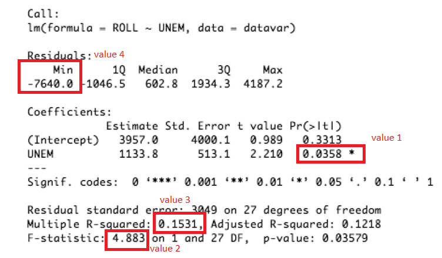
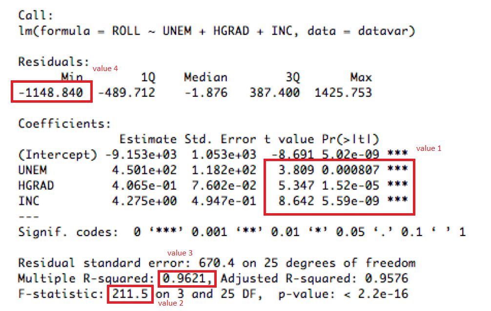
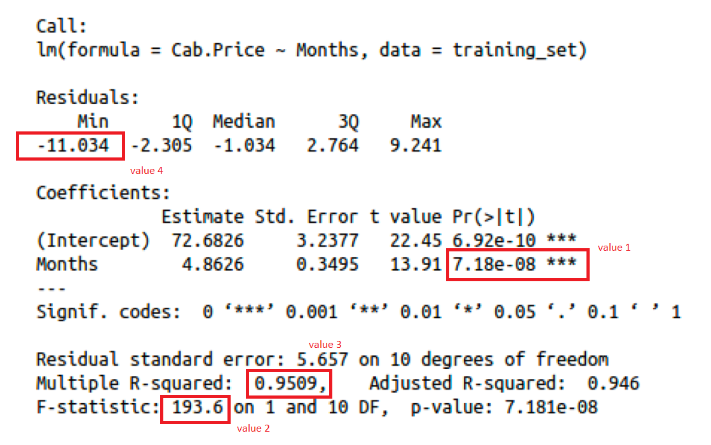

JOSE RICARDO MERIDA LOPEZ
23006385


```{r}
library(dplyr)
library(ggplot2)
library(corrplot)
library(PerformanceAnalytics)
```


```{r}

dataset<-read.csv("Admisions.csv")

print(dataset)

dataset<-dataset %>%
  select(-Serial.No.)

dataset

```

```{r}
cor(dataset)
```
```{r}
corrplot(cor(dataset),
         method = "number",
         type = "upper")

```
```{r}
chart.Correlation(dataset, histogram = TRUE, cex=1)
```

```{r}
dataset<-dataset %>%
  select(GRE.Score,Chance.of.Admit)
```


## -----------------------   EJERICICIO 1 ----------------------------
## -----------------------   PREGUNTA 1 ----------------------------
## Un arreglo con los valores de los estimadores para 𝛽o y 𝛽1 

## -------------- RESPUESTA 1 --------------------------------

```{r}


n_1<-nrow(dataset)

dataset <- dataset %>% mutate(xy = GRE.Score * Chance.of.Admit)
dataset <- dataset %>% mutate(xx = GRE.Score * GRE.Score)

resum_1<-dataset %>%
  summarise(
    sum_x = sum(GRE.Score),
    sum_y = sum(Chance.of.Admit),
    sum_xy = sum(xy),
    sum_xx = sum(xx)
  )

x_sum<-as.double(resum_1$sum_x)
y_sum<-as.double(resum_1$sum_y)
xy_sum<-as.double(resum_1$sum_xy)
xx_sum<-as.double(resum_1$sum_xx)

beta_1<-((x_sum*y_sum-n_1*xy_sum)/(x_sum*x_sum-n_1*xx_sum))


print("BETA 1")
print(beta_1)

beta_0<-((y_sum-beta_1*x_sum)/(n_1))

print("BETA 0")
print(beta_0)


```
## -----------------------   EJERICICIO 1 ----------------------------
## -----------------------   PREGUNTA 2 ----------------------------
## El valor del coeficiente de determinación R^2 del modelo.

## -------------- RESPUESTA 2 --------------------------------
```{r}
y_mean <- mean(dataset$Chance.of.Admit)

dataset <- dataset %>% mutate(y_test = beta_0+GRE.Score *beta_1)

dataset <- dataset %>% mutate(error_dif_y_ymean = (Chance.of.Admit-y_mean)^2)

dataset <- dataset %>% mutate(error_dif_ytest_ymean = (y_test-y_mean)^2)

dataset <- dataset %>% mutate(error_dif = abs(y_test-Chance.of.Admit))


resum_2<-dataset %>%
  summarise(
    sum_y_ymean = sum(error_dif_y_ymean),
    sum_ytest_ymean = sum(error_dif_ytest_ymean)
  )

y_ymean_sum<-as.double(resum_2$sum_y_ymean)
ytest_ymean_sum<-as.double(resum_2$sum_ytest_ymean)

val_r2<-ytest_ymean_sum/y_ymean_sum

print(val_r2)

```
## -----------------------   EJERICICIO 1 ----------------------------
## -----------------------   PREGUNTA 3 ----------------------------
## El coeficiente de correlación 𝑟 (raíz cuadrada de 𝑟#).

## -------------- RESPUESTA 3 --------------------------------
```{r}
val_r<-sqrt(val_r2)
print(val_r)

```
## -----------------------   EJERICICIO 1 ----------------------------
## -----------------------   PREGUNTA 4 ----------------------------
## Un arreglo con los valores de los residuos.

## -------------- RESPUESTA 4 --------------------------------

```{r}
print(dataset$error_dif)

hist(dataset$error_dif)
```
## -----------------------   EJERICICIO 1 ----------------------------
## -----------------------   PREGUNTA 5 ----------------------------
## Una gráfica con la nube de puntos y la recta de regresión del modelo.

## -------------- RESPUESTA 5 --------------------------------

```{r}
# Graficar la nube de puntos desde el dataframe
plot(dataset$GRE.Score, dataset$Chance.of.Admit, pch = 16, col = "blue", xlab = "x", ylab = "y", main = "Chance of admit")


abline(a = beta_0, b = beta_1, col = "red", lwd = 2)

```

## -----------------------   EJERICICIO 2 ----------------------------
## -----------------------   PREGUNTA 1 ----------------------------
## Realice un análisis estadístico sobre todas las variables del 
## dataset, recuerde que pude usar la función summary().

## -------------- RESPUESTA 1 --------------------------------

```{r}

dataset<-read.csv("Admisions.csv")

dataset<-dataset %>%
  select(-Serial.No.)


lm1<-dataset %>%
  lm(formula = Chance.of.Admit ~ .)

summary(lm1)

```

## -----------------------   EJERICICIO 2 ----------------------------
## -----------------------   PREGUNTA 2 ----------------------------
## Realice una gráfica de densidad para cada una de las variables
## numéricas en el dataset: GRE.Score, TOEFEL.Score, CGPA y Chance of
## Admit.

## -------------- RESPUESTA 2 -------------------------------

```{r}
hist(dataset$GRE.Score, freq = FALSE, main = "Histograma y densidad",
     ylab = "Densidad")

hist(dataset$TOEFL.Score, freq = FALSE, main = "Histograma y densidad",
     ylab = "Densidad")

hist(dataset$CGPA, freq = FALSE, main = "Histograma y densidad",
     ylab = "Densidad")

hist(dataset$Chance.of.Admit, freq = FALSE, main = "Histograma y densidad",
     ylab = "Densidad")


```

## -----------------------   EJERICICIO 2 ----------------------------
## -----------------------   PREGUNTA 3 ----------------------------
## Realice una gráfica de correlación entre las variables del inciso
## anterior.

## -------------- RESPUESTA 3 -------------------------------

```{r}

dataset_1<- dataset %>%
  select(GRE.Score, TOEFL.Score, CGPA, Chance.of.Admit)

chart.Correlation(dataset_1, histogram = TRUE, cex=1)

```
## -----------------------   EJERICICIO 2 ----------------------------
## -----------------------   PREGUNTA 4 ----------------------------
## Realice comentarios sobre el análisis estadístico de las variables
## numéricas y la gráfica de correlación.

## -------------- RESPUESTA 4 -------------------------------
## En los graficos anteriores se puede observar que hay una fuerte correlacion entre 
## las variables GRE.Score, TOEFL.Score, CGPA y la variable Chance.of.Admit, por lo que
## esta ultima si puede tener una alta dependencia de las variables anteriores. 

## -----------------------   EJERICICIO 2 ----------------------------
## -----------------------   PREGUNTA 5 ----------------------------
## Realice un scatter plot (nube de puntos) de todas las variables
## numéricas contra la variable Chance of Admit.

## -------------- RESPUESTA 5 -------------------------------


```{r}
# Crear un dataframe de ejemplo

# Establecer el diseño de la imagen
par(mfrow = c(3, 2))  # 2 filas y 2 columnas de paneles

# Graficar cada scatterplot en un panel separado
plot(dataset$Chance.of.Admit, dataset$GRE.Score, pch = 16, col = "blue", xlab = "x1", ylab = "y", main = "GRE.Score - Chance.of.Admit")
plot(dataset$TOEFL.Score, dataset$Chance.of.Admit, pch = 16, col = "red", xlab = "x2", ylab = "y", main = "TOEFL.Score - Chance.of.Admit")
plot(dataset$Chance.of.Admit, dataset$University.Rating, pch = 16, col = "green", xlab = "x3", ylab = "y", main = "University.Rating - Chance.of.Admit")
plot(dataset$Chance.of.Admit, dataset$SOP, pch = 16, col = "black", xlab = "x3", ylab = "y", main = "SOP - Chance.of.Admit")
plot(dataset$Chance.of.Admit, dataset$LOR, pch = 16, col = "cyan", xlab = "x3", ylab = "y", main = "LOR - Chance.of.Admit")
plot(dataset$Chance.of.Admit, dataset$CGPA, pch = 16, col = "gray", xlab = "x3", ylab = "y", main = "CGPA - Chance.of.Admit")
```

## -----------------------   EJERICICIO 2 ----------------------------
## -----------------------   PREGUNTA 6 ----------------------------
## Utilizando la función train y trainControl para crear un crossvalidation y le permita evaluar los ## siguientes modelos:
## • Chance of Admit ~ TOEFEL.Score.
## • Chance of Admit ~ CGPA.
## • Chance of Admit ~ GRE.Score.
## • Chance of Admit ~ TOEFEL.Score + CGPA.
## • Chance of Admit ~ TOEFEL.Score + GRE.Score.
## • Chance of Admit ~ GRE.Score + CGPA.
## • Chance of Admit ~ TOEFEL.Score + CGPA + GRE.Score.

## -------------- RESPUESTA 6 -----------------------------


## • Chance of Admit ~ TOEFEL.Score.
```{r}
lm1<-dataset %>%
  lm(formula = Chance.of.Admit ~ TOEFL.Score)

summ_lm1<-summary(lm1)
summ_lm1
```
## • Chance of Admit ~ CGPA.
```{r}
lm2<-dataset %>%
  lm(formula = Chance.of.Admit ~ CGPA)

summ_lm2<-summary(lm2)
summ_lm2
```
## • Chance of Admit ~ GRE.Score.
```{r}
lm3<-dataset %>%
  lm(formula = Chance.of.Admit ~ GRE.Score)

summ_lm3<-summary(lm3)
summ_lm3
```
## • Chance of Admit ~ TOEFEL.Score + CGPA
```{r}
lm4<-dataset %>%
  lm(formula = Chance.of.Admit ~ TOEFL.Score + CGPA)

summ_lm4<-summary(lm4)
summ_lm4
```
## • Chance of Admit ~ TOEFEL.Score + GRE.Score.
```{r}
lm5<-dataset %>%
  lm(formula = Chance.of.Admit ~ TOEFL.Score + GRE.Score)

summ_lm5<-summary(lm5)
summ_lm5
```
## • Chance of Admit ~ GRE.Score + CGPA.

```{r}
lm6<-dataset %>%
  lm(formula = Chance.of.Admit ~ GRE.Score + CGPA)

summ_lm6<-summary(lm6)
summ_lm6
```
## • Chance of Admit ~ TOEFEL.Score + CGPA + GRE.Score.
```{r}
lm7<-dataset %>%
  lm(formula = Chance.of.Admit ~ TOEFL.Score + GRE.Score + CGPA)

summ_lm7<-summary(lm7)
summ_lm7
```

## -----------------------   EJERICICIO 3 ----------------------------
## -----------------------   PREGUNTA 1 ----------------------------

## Modelo #1:

## -------------- RESPUESTA 1 -----------------------------


{width=width height=height}
El valor 1 indica la probabilidad que tiene el modelo de que sea mayor a 2.5 el valor de t.
El valor 2 debe ser mayor a 5.
El valor 3 indica el R2, este debe ser mayor a 0.55
El valor 4 indica el error encontrado en el modelo, (la distancia que hay del modelo al punto lejano)
Por lo que para el modelo 1 la variable UNEM, no es significativa para nuestro modelo.

{width=width height=height}

El valor 1 indica la probabilidad que tiene el modelo de que sea mayor a 2.5 el valor de t.
El valor 2 debe ser mayor a 5.
El valor 3 indica el R2, este debe ser mayor a 0.55
El valor 4 indica el error encontrado en el modelo, (la distancia que hay del modelo al punto lejano)
Por lo que para el modelo 2, las variables HGRAD, INC, aportan al modelo, en el caso de std. ERROR nos indica que el error es muy grande para este modelo, por lo que la variable UNEM, nos esta generando mucho ruido.


{width=width height=height}

El valor 1 indica la probabilidad que tiene el modelo de que sea mayor a 2.5 el valor de t.
El valor 2 debe ser mayor a 5.
El valor 3 indica el R2, este debe ser mayor a 0.55
El valor 4 indica el error encontrado en el modelo, (la distancia que hay del modelo al punto lejano)
Por lo que para el modelo 2, las variables HGRAD, INC, aportan al modelo, en el caso de std. ERROR nos indica que el error es muy grande para este modelo, por lo que la variable UNEM, nos esta generando mucho ruido.


{width=width height=height}
El valor 1 indica la probabilidad que tiene el modelo de que sea mayor a 2.5 el valor de t.
El valor 2 debe ser mayor a 5.
El valor 3 indica el R2, este debe ser mayor a 0.55
El valor 4 indica el error encontrado en el modelo, (la distancia que hay del modelo al punto lejano)
Por lo que para el modelo 2, la variable Months si es significante para el modelo, ya que cumple con estos parametros. 


